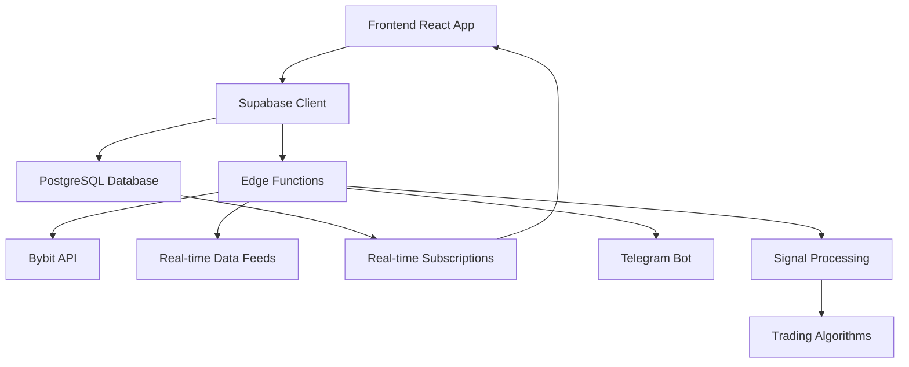
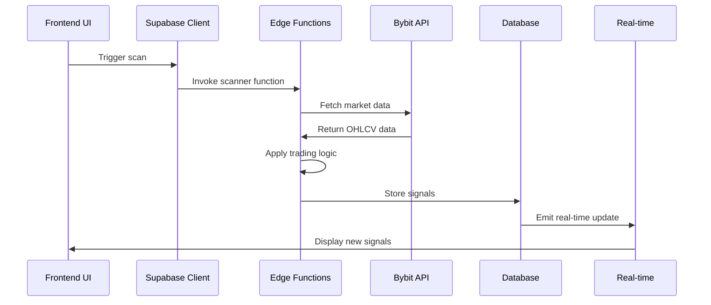
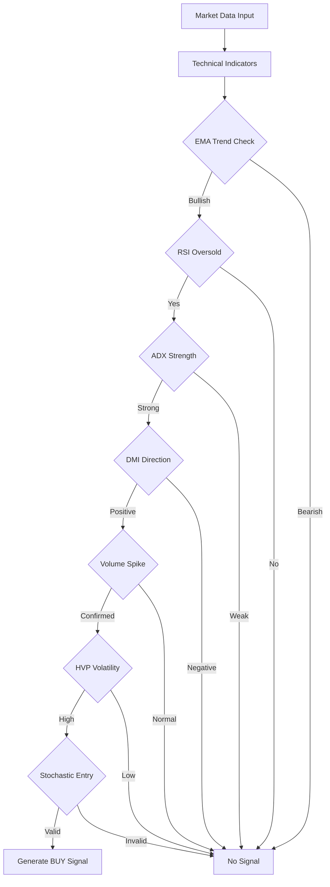

# AItradeX1 Technical Documentation

## 🏗️ **System Architecture**

### **High-Level Overview**



### **Component Architecture**

#### **Frontend Components**
```
src/components/
├── ui/                          # Base UI components (shadcn/ui)
├── AItradeX1SystemDashboard.tsx # X2 system interface
├── ComprehensiveScannerDashboard.tsx # Main scanner
├── TradingChart.tsx             # Chart visualization
├── MarketOverview.tsx           # Market summary
├── SignalsList.tsx              # Signal display
├── BacktestEngine.tsx           # Backtesting interface
├── PortfolioStats.tsx           # Portfolio metrics
├── TelegramIntegration.tsx      # Telegram controls
├── QuantumAnalysis.tsx          # Advanced analysis
└── SpynxScoreCard.tsx           # Scoring display
```

#### **Page Structure**
```
src/pages/
├── Index.tsx                    # Main dashboard (/)
├── X.tsx                        # Advanced Platform (/X)
├── X1.tsx                       # Confluence Platform (/X1)
├── X2.tsx                       # 7-Condition System (/X2)
├── AItradeX1Original.tsx        # Legacy System (/AITRADEX1ORIGINAL)
├── Health.tsx                   # System health (/health)
└── NotFound.tsx                 # 404 handler
```

---

## 🔄 **Data Flow Architecture**

### **Real-time Signal Generation**



### **Trading Logic Flow**



---

## 📊 **Database Schema**

### **Core Tables**

#### **signals**
```sql
CREATE TABLE signals (
    id UUID PRIMARY KEY DEFAULT gen_random_uuid(),
    exchange TEXT NOT NULL,
    symbol TEXT NOT NULL,
    timeframe TEXT NOT NULL,
    direction TEXT NOT NULL,
    bar_time TIMESTAMPTZ NOT NULL,
    entry_price NUMERIC,
    stop_loss NUMERIC,
    take_profit NUMERIC,
    confidence_score NUMERIC,
    signal_strength TEXT DEFAULT 'MEDIUM',
    risk_level TEXT DEFAULT 'MEDIUM',
    metadata JSONB DEFAULT '{}',
    status TEXT DEFAULT 'active',
    generated_at TIMESTAMPTZ DEFAULT NOW(),
    UNIQUE(exchange, symbol, timeframe, direction, bar_time)
);
```

#### **strategy_signals**
```sql
CREATE TABLE strategy_signals (
    id UUID PRIMARY KEY DEFAULT gen_random_uuid(),
    user_id UUID,
    market_id UUID,
    strategy TEXT NOT NULL,
    side TEXT NOT NULL,
    confidence NUMERIC,
    score NUMERIC,
    entry_hint NUMERIC,
    sl_hint NUMERIC,
    tp_hint NUMERIC,
    meta JSONB DEFAULT '{}',
    generated_at TIMESTAMPTZ DEFAULT NOW(),
    is_active BOOLEAN DEFAULT true
);
```

#### **spynx_scores**
```sql
CREATE TABLE spynx_scores (
    id UUID PRIMARY KEY DEFAULT gen_random_uuid(),
    token_symbol TEXT NOT NULL,
    token_name TEXT,
    score NUMERIC NOT NULL DEFAULT 0,
    market_cap NUMERIC,
    volume_24h NUMERIC,
    price_change_24h NUMERIC,
    liquidity NUMERIC,
    holder_count INTEGER,
    whale_activity NUMERIC,
    sentiment NUMERIC,
    roi_forecast NUMERIC,
    price NUMERIC,
    metadata JSONB DEFAULT '{}',
    created_at TIMESTAMPTZ DEFAULT NOW(),
    updated_at TIMESTAMPTZ DEFAULT NOW()
);
```

---

## ⚡ **Edge Functions Reference**

### **Core Scanner Functions**

#### **aitradex1-advanced-scanner**
```typescript
// Purpose: Advanced trading logic with adaptive AI weighting
// Input: { symbols: string[], timeframes: string[] }
// Output: Signal[] with confidence scores

interface ScanRequest {
  symbols?: string[];
  timeframes?: string[];
  exchange?: string;
  relaxed_filters?: boolean;
}

interface SignalOutput {
  symbol: string;
  timeframe: string;
  direction: 'BUY' | 'SELL';
  confidence_score: number;
  entry_price: number;
  stop_loss: number;
  take_profit: number;
  metadata: {
    ema21: number;
    ema200: number;
    rsi: number;
    adx: number;
    volume_spike: boolean;
    hvp: number;
  };
}
```

#### **bybit-comprehensive-scanner**
```typescript
// Purpose: Comprehensive scanning of all Bybit USDT pairs
// Auto-fetches all available trading pairs
// Processes in batches to respect rate limits

interface ComprehensiveScanConfig {
  timeframes: string[];
  batch_size: number;
  rate_limit_delay: number;
  confidence_threshold: number;
}

// Scans 500+ symbols automatically
// Returns qualified signals only
// Implements intelligent rate limiting
```

### **Analysis Functions**

#### **quantum-analysis**
```typescript
// Advanced market analysis using quantum-inspired algorithms
interface QuantumAnalysisResult {
  market_phase: 'accumulation' | 'markup' | 'distribution' | 'decline';
  volatility_regime: 'low' | 'medium' | 'high';
  momentum_strength: number;
  support_resistance: {
    support_levels: number[];
    resistance_levels: number[];
  };
  probability_matrix: {
    bullish_probability: number;
    bearish_probability: number;
    sideways_probability: number;
  };
}
```

#### **sentiment-analysis**
```typescript
// Market sentiment evaluation
interface SentimentData {
  overall_sentiment: number; // -1 to 1
  fear_greed_index: number;  // 0 to 100
  social_sentiment: {
    twitter_score: number;
    reddit_score: number;
    news_sentiment: number;
  };
  on_chain_metrics: {
    whale_movements: number;
    exchange_inflows: number;
    long_short_ratio: number;
  };
}
```

---

## 🔧 **Technical Indicators Implementation**

### **EMA (Exponential Moving Average)**
```typescript
function calculateEMA(prices: number[], period: number): number[] {
  const ema: number[] = [];
  const multiplier = 2 / (period + 1);
  
  // First EMA is SMA
  let sum = 0;
  for (let i = 0; i < period; i++) {
    sum += prices[i];
  }
  ema[period - 1] = sum / period;
  
  // Calculate subsequent EMAs
  for (let i = period; i < prices.length; i++) {
    ema[i] = (prices[i] - ema[i - 1]) * multiplier + ema[i - 1];
  }
  
  return ema;
}
```

### **RSI (Relative Strength Index)**
```typescript
function calculateRSI(prices: number[], period: number = 14): number[] {
  const gains: number[] = [];
  const losses: number[] = [];
  
  // Calculate price changes
  for (let i = 1; i < prices.length; i++) {
    const change = prices[i] - prices[i - 1];
    gains.push(change > 0 ? change : 0);
    losses.push(change < 0 ? Math.abs(change) : 0);
  }
  
  // Calculate average gains and losses
  const avgGains = calculateSMA(gains, period);
  const avgLosses = calculateSMA(losses, period);
  
  const rsi: number[] = [];
  for (let i = 0; i < avgGains.length; i++) {
    const rs = avgGains[i] / avgLosses[i];
    rsi.push(100 - (100 / (1 + rs)));
  }
  
  return rsi;
}
```

### **ADX (Average Directional Index)**
```typescript
function calculateADX(high: number[], low: number[], close: number[], period: number = 14): {
  adx: number[];
  plusDI: number[];
  minusDI: number[];
} {
  const tr: number[] = [];
  const plusDM: number[] = [];
  const minusDM: number[] = [];
  
  // Calculate True Range and Directional Movements
  for (let i = 1; i < high.length; i++) {
    const hl = high[i] - low[i];
    const hc = Math.abs(high[i] - close[i - 1]);
    const lc = Math.abs(low[i] - close[i - 1]);
    tr.push(Math.max(hl, hc, lc));
    
    const upMove = high[i] - high[i - 1];
    const downMove = low[i - 1] - low[i];
    
    plusDM.push(upMove > downMove && upMove > 0 ? upMove : 0);
    minusDM.push(downMove > upMove && downMove > 0 ? downMove : 0);
  }
  
  // Smooth the values
  const smoothedTR = smoothArray(tr, period);
  const smoothedPlusDM = smoothArray(plusDM, period);
  const smoothedMinusDM = smoothArray(minusDM, period);
  
  // Calculate DI values
  const plusDI = smoothedPlusDM.map((dm, i) => (dm / smoothedTR[i]) * 100);
  const minusDI = smoothedMinusDM.map((dm, i) => (dm / smoothedTR[i]) * 100);
  
  // Calculate DX and ADX
  const dx = plusDI.map((pdi, i) => {
    const mdi = minusDI[i];
    return Math.abs(pdi - mdi) / (pdi + mdi) * 100;
  });
  
  const adx = smoothArray(dx, period);
  
  return { adx, plusDI, minusDI };
}
```

---

## 🔐 **Security Implementation**

### **Row Level Security (RLS) Policies**

```sql
-- Example RLS policy for signals table
CREATE POLICY "Service role can manage signals" ON signals
FOR ALL USING (
  (auth.jwt() ->> 'role'::text) = 'service_role'::text
);

CREATE POLICY "Authenticated users can view signals" ON signals
FOR SELECT USING (
  auth.uid() IS NOT NULL
);
```

### **Input Validation Function**
```sql
CREATE OR REPLACE FUNCTION validate_user_input_comprehensive(
  input_text text,
  input_type text DEFAULT 'general',
  max_length integer DEFAULT 1000,
  additional_patterns text[] DEFAULT ARRAY[]::text[]
) RETURNS jsonb AS $$
DECLARE
  validation_result jsonb;
  is_valid boolean := true;
  error_messages text[] := '{}';
  sanitized_input text;
  suspicious_patterns text[] := ARRAY[
    '<script[^>]*>.*?</script>',
    'javascript:',
    'union\s+select',
    'drop\s+table'
    -- Additional XSS and SQL injection patterns
  ];
BEGIN
  -- Validation logic here
  -- Returns sanitized input and validation status
END;
$$ LANGUAGE plpgsql SECURITY DEFINER;
```

---

## 📈 **Performance Optimization**

### **Database Optimization**
- **Indexes** on frequently queried columns
- **Materialized views** for complex aggregations
- **Connection pooling** for edge functions
- **Query optimization** with EXPLAIN ANALYZE

### **Frontend Optimization**
- **React.memo** for expensive components
- **useMemo/useCallback** for computations
- **Virtual scrolling** for large signal lists
- **Debounced API calls** for user interactions

### **Real-time Optimization**
- **WebSocket connection pooling**
- **Selective subscriptions** based on active views
- **Message batching** for high-frequency updates
- **Client-side caching** of historical data

---

## 🔄 **API Rate Limiting**

### **Bybit API Limits**
```typescript
const RATE_LIMITS = {
  public: {
    weight: 120,      // requests per minute
    burst: 10         // concurrent requests
  },
  private: {
    weight: 600,      // requests per minute  
    burst: 10         // concurrent requests
  }
};

class RateLimiter {
  private tokens: number;
  private lastRefill: number;
  
  constructor(private capacity: number, private refillRate: number) {
    this.tokens = capacity;
    this.lastRefill = Date.now();
  }
  
  async acquire(cost: number = 1): Promise<void> {
    this.refillTokens();
    
    if (this.tokens < cost) {
      const waitTime = (cost - this.tokens) / this.refillRate * 60000;
      await new Promise(resolve => setTimeout(resolve, waitTime));
      this.refillTokens();
    }
    
    this.tokens -= cost;
  }
  
  private refillTokens(): void {
    const now = Date.now();
    const elapsed = (now - this.lastRefill) / 60000; // minutes
    const tokensToAdd = elapsed * this.refillRate;
    
    this.tokens = Math.min(this.capacity, this.tokens + tokensToAdd);
    this.lastRefill = now;
  }
}
```

---

## 🧪 **Testing Strategy**

### **Unit Tests**
```typescript
// Example test for trading logic
describe('AItradeX1 Trading Logic', () => {
  test('should generate BUY signal when all conditions met', () => {
    const marketData = {
      ema21: 45000,
      ema200: 44000,
      rsi: 35,
      adx: 30,
      plusDI: 25,
      minusDI: 15,
      volume: 1000000,
      avgVolume: 700000,
      hvp: 70,
      stochK: 15,
      stochD: 12
    };
    
    const signal = generateSignal(marketData);
    expect(signal.direction).toBe('BUY');
    expect(signal.confidence_score).toBe(7);
  });
});
```

### **Integration Tests**
```typescript
// Test edge function integration
describe('Scanner Integration', () => {
  test('should scan and return valid signals', async () => {
    const response = await supabase.functions.invoke('aitradex1-advanced-scanner', {
      body: {
        symbols: ['BTCUSDT'],
        timeframes: ['15m']
      }
    });
    
    expect(response.data).toBeDefined();
    expect(response.data.signals).toBeInstanceOf(Array);
  });
});
```

---

This technical documentation provides a comprehensive overview of the AItradeX1 platform architecture, implementation details, and development guidelines.